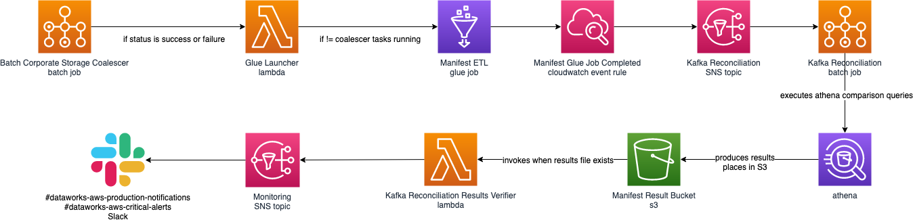

# dataworks-kafka-reconciliation-infrastructure

## Kafka Reconciliation Process
This repo contains the infrastructure for the three key lambdas, batch jobs and compute environment and an SNS topic that together create the Kafka Reconciliation Process.

### What & Why
We want to reconcile the messages received from UC over the Kafka Broker, ensuring our consumers have received all messages, placed them in Hbase and are retrievable from Hbase.
There is a chain of different products / applications which are used to validate the kafka input equals the Hbase output.

The data reconciliation process compares the individual records across the timespan that have been imported from the data dump to the individual records that are exported to Crown. This provides very high confidence in the data quality and that no records are missing from the Kafka stream or have gone missing during the ingestion process.

### How & When
The sequence of events which are chained, that create the 'Kafka Reconciliation Process'.

1. The batch job `batch_corporate_storage_coalescer` is started via Cloudwatch Rules located [here](https://github.com/dwp/dataworks-aws-ingest-consumers/blob/master/batch_coalescer_trigger_events.tf), which run in the early hours of the morning. 
   A detailed explanation of the tasks activity can be found on the [dataworks-corporate-storage-coalescence readme](https://github.com/dwp/dataworks-corporate-storage-coalescence)
1. Alternatively the manual way to trigger the `batch_corporate_storage_coalescer` is via the ConcourseCI Pipeline `corporate-storage-coalescer`.
1. Status updates for the `batch_corporate_storage_coalescer` & `batch_corporate_storage_coalescer` batch jobs invoke the `glue_launcher` lambda via a Cloudwatch event rule of the same name.
1. Upon ETL Glue job completion, the `manifest_glue_job_completed` Cloudwatch rule will fire. This rule will send an SNS message to `kafka_reconciliation` SNS topic.
1. The receipt of the SNS topic `kafka_reconciliation` is the `athena_reconciliation_launcher` lambda. This lambda will launch the `kafka-reconciliation` batch job.
1. The `kafka-reconciliation` batch job will run Athena queries - comparing data. Once finished, the batch job outputs results to S3 location `business-data/manifest/query-output_streaming_main_incremental/results/`
1. On the presence of objects in the S3 prefix `business-data/manifest/query-output_streaming_main_incremental/results/`, the `kafka_reconciliation_results_verifier` lambda is invoked by an S3 alert.
1. The `kafka_reconciliation_results_verifier` lambda reviews the items in the S3 location, and alerts via Slack the counts for total and missing exports.
1. The Slack alerts are sent to `#dataworks-aws-production-notifications` if successful or `#dataworks-aws-critical-alerts` if unsuccessful.

## What will it show?
The report in to the data quality will show nine pieces of information, the first four of which are:

Databases which are in the Mongo database backup but are not represented in the streamed Kafka data
Databases which are represented in the streamed Kafka data but not in the Mongo database backup
Collections which are in the Mongo database backup but are not represented in the streamed Kafka data
Collections which are represented in the streamed Kafka data but not in the Mongo database backup
The remaining pieces of information are below and will be grouped by collection:

IDs which are in the Mongo database backup but are not represented in the streamed Kafka data
IDs which are represented in the streamed Kafka data but not in the Mongo database backup
IDs which have a later timestamp in the Mongo database backup than they do in the streamed Kafka data
IDs which have a later timestamp in the streamed Kafka data than they do in the Mongo database backup
Percentages (compared to all IDs) and counts of IDs which are in categories 5-8
For the above categories, the following information will be shown for each ID in them:

Full ID
Timestamp in Mongo backup (if ID present here)
Timestamp in Kafka stream (if ID present here)
Collection
Database

## Contents of the actual manifest files

The manifests contain the following:

* One row in a CSV format for each record:
* * For K2HB, this is every valid record that is decrypted and imported
* * For HTME, this is every valid record that is written to a snapshot file successfully
* Each row contains the following information for a record:
* * The "id" field for the record which is used as HBase record key, pre-formatted
* * The timestamp that is against the record in epoch format
* * The database the record is from
* * The collection the record is from
* * The type of record (i.e. IMPORT or EXPORT)
* * The source of the record (either "K2HB" or the "@type" field from Kafka messages)

## Technical Details
### Report generation - technical details
The manifest set generation is explained above and for technical details on HDI or HTME have a lot at their individual repos.

This repo contains the code to generate the manifest report itself and so will explain the technical details here. Manifest generation is done via the behave feature manifest-generation and the code can be found there. There are a number of steps that are performed when a manifest is generated. You should be able to view the features and steps in the behave code and follow what they do against the steps below.

### Create Athena tables
The first step is to generate Athena tables for the manifest sets. There are sql template files for creating these tables that CI passes in the location of the manifest sets from the terraform outputs. Two tables are created - one for import and one for export. They act as layers over the top of the S3 locations - when a query is executed in Athena, it actually runs directly against the S3 files using the table as a structure pointer for the files. We use CSV format for the manifests and this correlates to columns in the Athena tables.

### Execute Glue job
AWS Glue is used to generate a combined table from the import and export Athena tables. To do this, there is a job (stored and deployed from aws-ingestion repo) which gets the data from the Athena tables and performs pyspark jobs on the data to generate a full table of all records. Matching ids from both tables go on the same row and calculations like which manifest set has the earliest timestamp, the types of records and other things are worked out in the glue job and added to the table. The results are saved are perquet files (a format similar to json but more performant for big data queries). The glue job produces another Athena table for the combined data and this acts like the others. The difference is that this table sits over the parquet files in S3. If they were json format all the sql queries we run would time out.

### Generate the queries
In this repo, there are lots of SQL queries which we use to run against the combined table and produce the reports. See the top of this document for the explanations of each query output. Technically, these are Presto SQL queries as Athena runs Presto SQL under the hood. This is slightly different to Oracle syntax, MS SQL syntax or other SQL flavours but has documentation on the internet to help.

The queries are split in to different types and can be found in folders with the same name as the type.

### Production queries
These are the queries that make up the main report and are always run.

### Import queries
These are queries which tell us information about the import data only. We are not as concerned about the results of these as they are not something to be concerned about with missing data and more for information only. These don't run with the main production manifest, but can be run on their own.

### Specific queries
These are queries purely for information only and they help with debugging. They can only be run by themselves.

## Alerts
For further detail, see:
[Kafka reconciliation - missing records](https://git.ucd.gpn.gov.uk/dip/aws-common-infrastructure/wiki/DataWorks-AWS-Corporate-Storage#kafka-reconciliation---missing-records)
[Manifest glue job failed](https://git.ucd.gpn.gov.uk/dip/aws-common-infrastructure/wiki/DataWorks-AWS-Corporate-Storage#manifest-glue-job-failed)

## Legacy
The [behave framework](https://github.com/dwp/dataworks-behavioural-framework) currently operates the reconciliation on the `manifest-comparison` ConcourseCI pipeline. The new kafka reconciliation can be triggered by starting the `corporate-storage-coalescer` pipeline.
Further information regarding the legacy manifest comparison can be found in the [data reconciliation readme](https://github.com/dwp/dataworks-behavioural-framework/blob/master/docs/data-reconciliation.md)
